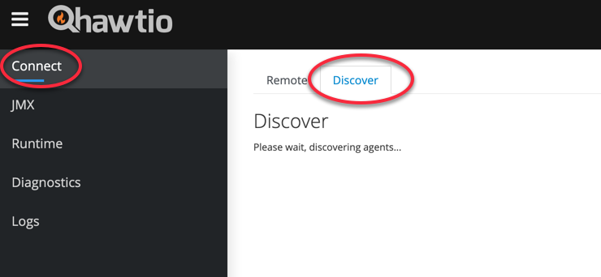
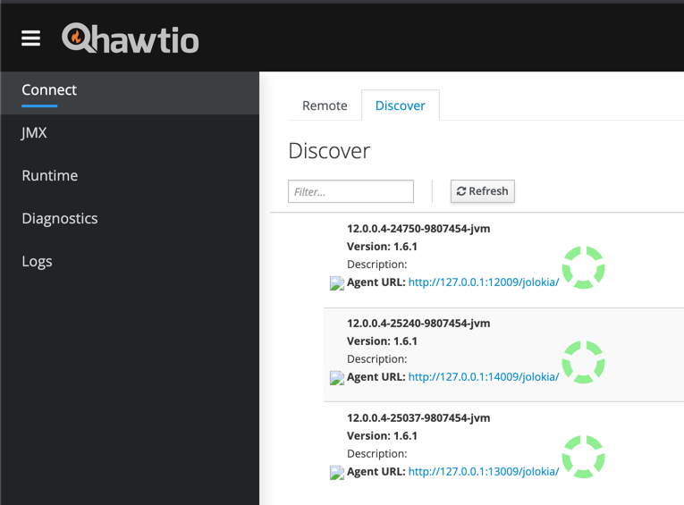
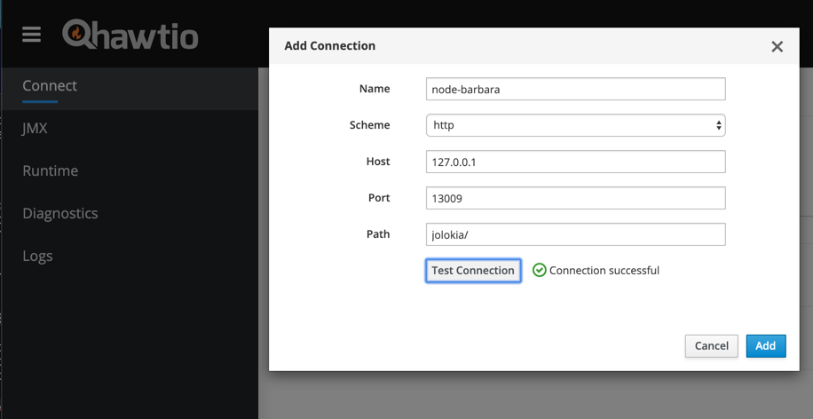
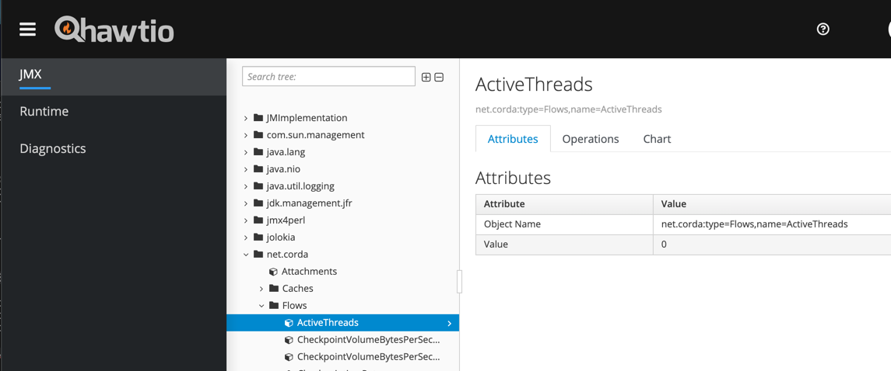

---


## Install Hawtio to view available metrics


### What is Hawtio?

[Hawtio](https://github.com/hawtio/hawtio) It's a pluggable management console for Java stuff which supports any kind of JVM, container or middleware. It provides a web dashboard for managing and monitoring JVM-based services. It works well with Jolokia consuming metrics in HTTP for viewing in a browser.

### Download the Hawtio binary
From [Hawtio's github repository](https://github.com/hawtio/hawtio) download the [Hawtio jar file](https://repo1.maven.org/maven2/io/hawt/hawtio-app/2.10.0/hawtio-app-2.10.0.jar)

```
{
mkdir -p ${HOME}/hawtio
cd ${HOME}/hawtio
curl -O https://repo1.maven.org/maven2/io/hawt/hawtio-app/2.10.0/hawtio-app-2.10.0.jar
}
```

### Start the Hawtio process in the background
When the process starts, check nohup.out for the url. The default port is 8080
```
nohup java -jar ${HOME}/hawtio/hawtio-app-2.10.0.jar &

grep hawtio nohup.out
```


### From your browser enter the URL provided for the Hawtio interface
```
http://{your-server-ip-address}:8080/hawtio
```

### Discover the available nodes
Click on "Connect" and click on the "Discover" tab




### Review available agents 
Agents on the machine should be discovered by Hawtio and connections to available agents should be create automatically. 



### Review available connections
If for some reason any of the agents do not create a connection, simply add the necessary details and test the connection manually.  



### Explore available metrics
Hawtio is installed and configured Hawtio you can now explore the available metrics supplied by the Corda nodes. 



### You have successfully completed this exercise!

